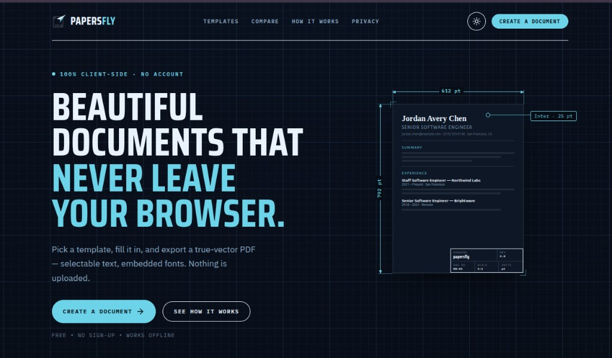
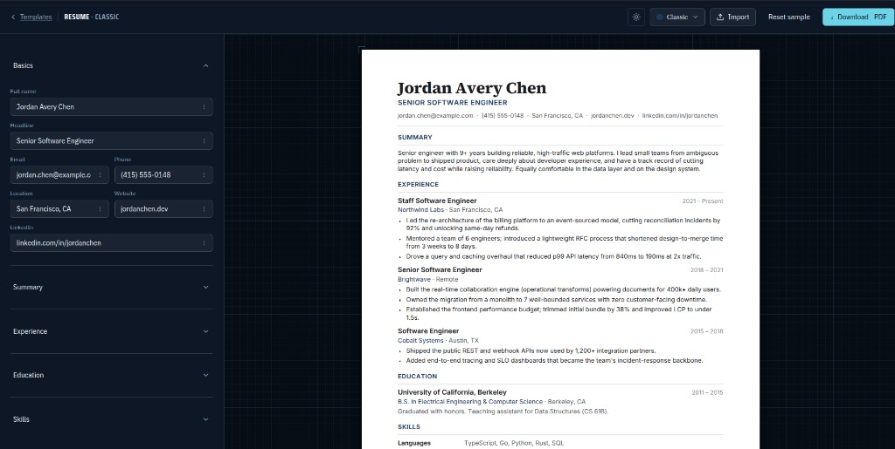

# papersfly

**Beautiful documents that never leave your browser.**

Pick a template, fill it in, and download a true-vector PDF — selectable text, embedded fonts, no watermark. Free. No sign-up. Nothing is uploaded.

**[Create a document](https://papersfly.com)** · [How it works](https://papersfly.com/#how) · [Privacy](https://papersfly.com/privacy)



## A finished PDF in three steps

1. **Choose a template.** Start with a resume, a cover letter, or an invoice. Each design is a real, print-ready page.
2. **Fill in the form.** Type on the left and watch the page update live, at true print size.
3. **Download.** One click gives you a PDF you can email, print, or upload to a job application.



## Why papersfly

- **Your document stays on your device.** Editing, preview, and the PDF itself all happen in the browser. There is no account, and no server receives what you type.
- **Free, with no catch.** No trial, no watermark, no paywall. Download as many times as you like.
- **Works offline.** After the first visit, you can disconnect and keep building and exporting.
- **A PDF people and software can actually read.** The file carries real selectable text and embedded fonts, so it prints cleanly and parses in applicant tracking systems.
- **What you see is what you download.** The on-screen page is the document. The PDF is that same layout, not a second design.

## What you can make

- **Resumes** — single-column layouts built for applications
- **Cover letters** — a matching page, ready to send with the resume
- **Invoices** — a clean bill you can download and send

[Create a resume](https://papersfly.com/create-resume) · [Write a cover letter](https://papersfly.com/create-cover-letter) · [Create an invoice](https://papersfly.com/create-invoice)

## Run it locally

```bash
pnpm install
pnpm dev
```

Open the localhost URL the dev server prints. Contributor notes — how the preview becomes the PDF, how to add a template — live in [AGENTS.md](AGENTS.md).
